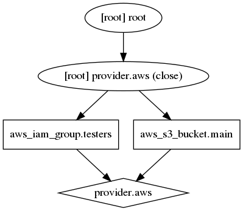
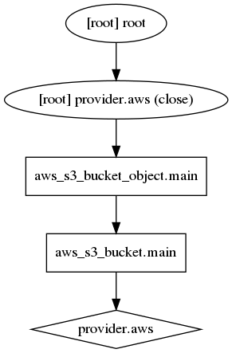
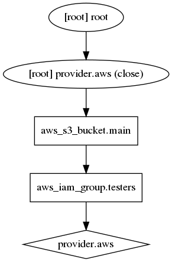

# Terraform: Infrastructure as code

### Aleksandr Usov

Senior System Engineer
HashiCorp Certified: Terraform Associate

---
# Agenda

- Infrastructure as code
- Terraform configuration
- Terraform settings

---
# Imperative Approach: create

The imperative focuses on how the infrastructure is to be changed

```bash
aws s3api create-bucket --bucket cf08973879519fa5610bc8b6ff6541 --region us-east-2 --create-bucket-configuration LocationConstraint=us-east-2
{
    "Location": "http://cf08973879519fa5610bc8b6ff6541.s3.amazonaws.com/"
}
```

```bash
$aws s3api create-bucket --bucket cf08973879519fa5610bc8b6ff6541 --region us-east-2 --create-bucket-configuration LocationConstraint=us-east-2

An error occurred (BucketAlreadyOwnedByYou) when calling the CreateBucket operation: Your previous request to create the named bucket succeeded and you already own it.
$ echo $?
255
```

---
# Imperative Approach: show

```bash
$ aws s3api list-buckets --region us-east-2
{
    "Buckets": [
        {
            "Name": "cf08973879519fa5610bc8b6ff6541",
            "CreationDate": "2020-04-30T20:05:56.000Z"
        }
    ],
    "Owner": {
        "ID": "905339dfcf0bb1be6066daadd65c3de1799387cf1d6eeb48581860f51ab59c8d"
    }
}
aws s3api list-buckets --region us-east-2 | jq .Buckets[0].Name
"cf08973879519fa5610bc8b6ff6541"
```

---
# Imperative Approach: delete

```bash
$ aws s3api delete-bucket --bucket cf08973879519fa5610bc8b6ff6541 --region us-east-2
$ aws s3api delete-bucket --bucket cf08973879519fa5610bc8b6ff6541 --region us-east-2

An error occurred (NoSuchBucket) when calling the DeleteBucket operation: The specified bucket does not exist
$ echo $?
255
```

---
# Declarative Approach

The declarative approach focuses on what the eventual target configuration should be:

```
resource "aws_s3_bucket" "main" {
  bucket = "cf08973879519fa5610bc8b6ff6541"
}
```

----
# Declarative Approach: create
```bash
$ terraform apply -auto-approve
aws_s3_bucket.main: Creating...
aws_s3_bucket.main: Still creating... [10s elapsed]
aws_s3_bucket.main: Creation complete after 12s [id=cf08973879519fa5610bc8b6ff6541]

Apply complete! Resources: 1 added, 0 changed, 0 destroyed.

Outputs:

arn = arn:aws:s3:::cf08973879519fa5610bc8b6ff6541
$ terraform apply -auto-approve
aws_s3_bucket.main: Refreshing state... [id=cf08973879519fa5610bc8b6ff6541]

Apply complete! Resources: 0 added, 0 changed, 0 destroyed.

Outputs:

arn = arn:aws:s3:::cf08973879519fa5610bc8b6ff6541
```

----
# Declarative Approach: destroy

```
$ terraform destroy -auto-approve
aws_s3_bucket.main: Refreshing state... [id=cf08973879519fa5610bc8b6ff6541]
aws_s3_bucket.main: Destroying... [id=cf08973879519fa5610bc8b6ff6541]
aws_s3_bucket.main: Destruction complete after 1s

Destroy complete! Resources: 1 destroyed.
$ terraform destroy -auto-approve


Destroy complete! Resources: 0 destroyed.
```

----
# Local Values

A local value assigns a name to an expression, allowing it to be used multiple times within a module without repeating.

Local values can be declared together in a single locals block:
```
locals {
  company    = "epam"
  department = "devops"
}
```

---
# Data Sources

Data sources allow data to be fetched or computed for use elsewhere in Terraform configuration.

```
data "aws_vpc" "main" {
  id = "vpc-505d8d3b"
}

output "vpc_id" {
  value = data.aws_vpc.main.main_route_table_id
}
```

```
$ terraform apply:
...
Outputs:

vpc_id = rtb-928810f9
```

---
# References to Named Values

The following named values are available:

- `<RESOURCE TYPE>.<NAME>`: an object representing a managed resource
- `var.<NAME>`: the value of the input variable
- `local.<NAME>`: the value of the local value
- `module.<MODULE NAME>.<OUTPUT NAME>`: the value of the specified output value
- `data.<DATA TYPE>.<NAME>`: an object representing a data resource
- `path.module`: the filesystem path of the module where the expression is placed
- `path.root`: the filesystem path of the root module of the configuration
- `path.cwd`: the filesystem path of the current working directory
- `terraform.workspace`: the name of the currently selected workspace

---

# Lifecycle Customizations

The following lifecycle meta-arguments are supported:
- `create_before_destroy (bool)`: a new replacement object is created first, and then the prior object is destroyed only once the replacement is created
- `prevent_destroy (bool)`: will cause Terraform to reject with an error any plan that would destroy the infrastructure object
- `ignore_changes (list of attribute names)`: he given attribute names are considered when planning a create operation, but are ignored when planning an update

---
# Terraform Flow

1. Configuration Loader; Backend; State Manager
1. Create terraform.Context(main object represents all the context that Terraform needs)
1. Graph Builder
1. Graph Walker
1. Vertex Evaluation

---
# Independent Resources

```
resource "aws_iam_group" "testers" {
  name = "testers"
  path = "/users/"
}

resource "aws_s3_bucket" "main" {
  bucket = "cf08973879519fa5610bc8b6ff6541"
}
```

---
# Independent Resources

```bash
$ terraform graph | grep -v meta.count-boundary | dot -Tpng > terraform_independent.png
```


---
# Implicit Dependency

```
resource "aws_s3_bucket" "main" {
  bucket = "cf08973879519fa5610bc8b6ff6541"
}

resource "aws_s3_bucket_object" "main" {
  key    = "someobject"
  bucket = aws_s3_bucket.main.id
  source = "/etc/debian_version"
}
```

---
# Implicit Dependency

```bash
$ terraform graph | grep -v meta.count-boundary | dot -Tpng > terraform_implicit.png
```


---
# Explicit Dependency

```
resource "aws_iam_group" "testers" {
  name = "testers"
  path = "/users/"
}

resource "aws_s3_bucket" "main" {
  bucket     = "cf08973879519fa5610bc8b6ff6541"
  depends_on = [aws_s3_bucket.main]
}
```

---
# Explicit Dependency

```bash
$ terraform graph | grep -v meta.count-boundary | dot -Tpng > terraform_explicit.png
```


---
# terraform import

The terraform import command is used to import existing resources into Terraform.

Usage: `terraform import [options] ADDRESS ID`

```
$ terraform import aws_s3_bucket.bucket new-bucket

resource "aws_s3_bucket" "bucket" {
  bucket = "new-bucket"
}
```

---
# State in AWS: bootstrap 

```
terraform {
  required_version = ">=0.12.24"
  required_providers {
    aws = ">= 2.58.0"
  }
}
provider "aws" {
  region = "eu-central-1"
}
locals {
  tags = {
    source = "terraform"
    env    = var.env
  }
}
resource "aws_s3_bucket" "backend" {
  bucket = "tf-..."
  acl    = "private"

  versioning {
    enabled = true
  }

  tags = local.tags
}
resource "aws_dynamodb_table" "backend_locks" {
  name         = "tf-..."
  billing_mode = "PAY_PER_REQUEST"
  hash_key     = "LockID"

  attribute {
    name = "LockID"
    type = "S"
  }

  tags = local.tags
}
```